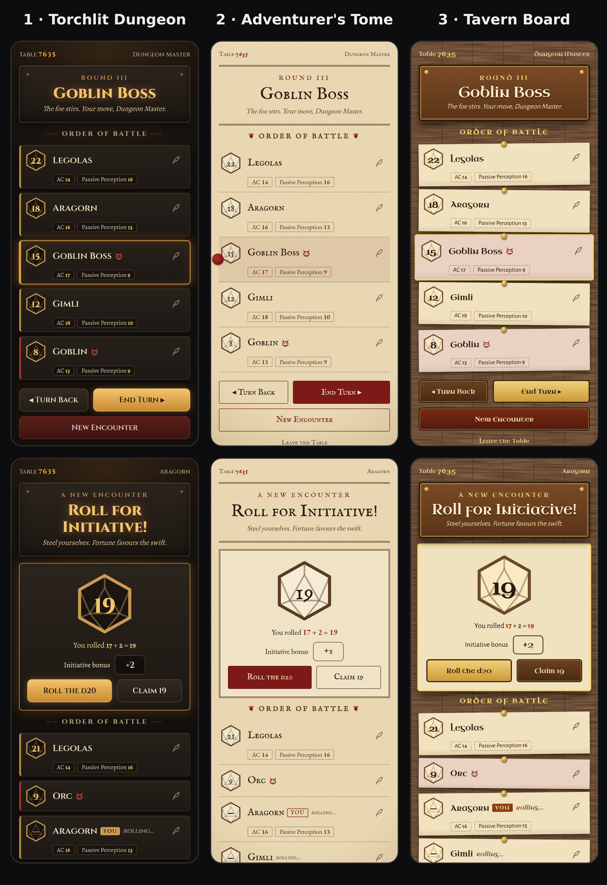

# Themes

Three visual directions were explored. **Torchlit Dungeon** is live; the other two are saved here,
ready for a future theme picker.

| Theme | Status | Palette | Mockup |
|---|---|---|---|
| Torchlit Dungeon | Live (default) | [torchlit.css](torchlit.css) | `mockups.html?theme=torch` |
| Adventurer's Tome | Saved | [tome.css](tome.css) | `mockups.html?theme=tome` |
| Tavern Board | Saved | [tavern.css](tavern.css) | `mockups.html?theme=tavern` |

`mockups.html` also takes `&screen=combat` (DM view, mid-combat) or `&screen=roll` (a player rolling
initiative). It is a standalone reference page, not part of the app build.

## How theming works

Every colour in the app comes from the CSS custom properties in the `:root` block of
`src/client/app.css` (components hard-code none). Each palette file sets the same tokens under a
`[data-theme="..."]` selector, so adding a theme picker is:

1. Copy the chosen palette files into `src/client/themes/` and import them in `src/client/main.ts`.
2. Set `document.documentElement.dataset.theme` from the picker (and remember it in `localStorage`).
3. Update `<meta name="theme-color">` to the theme's `--color-bg` so the phone's browser chrome matches.
4. For Tavern Board, use the extra `--color-text-on-bg` tokens described in `tavern.css`.

Every text and background pairing in all three palettes meets WCAG AA contrast (4.5:1 for text, 3:1
for the player/NPC edge colours).

Only colours are captured here so far. Fonts, textures and shapes for each direction are in
`mockups.html` and will move into the app as the Torchlit design is built out.
